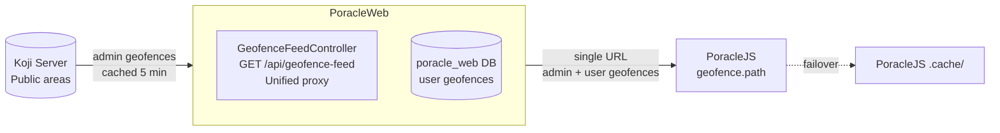
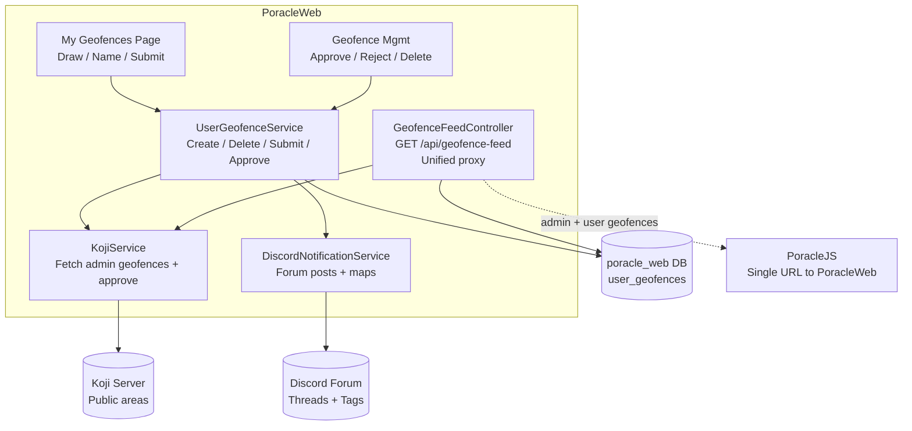
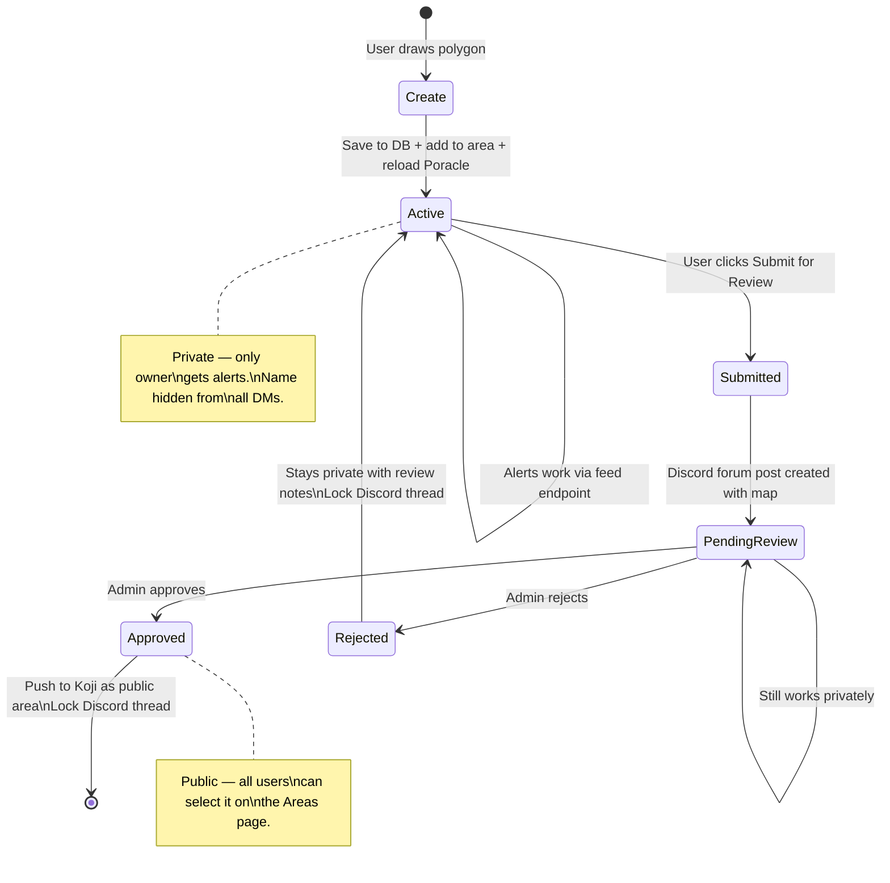
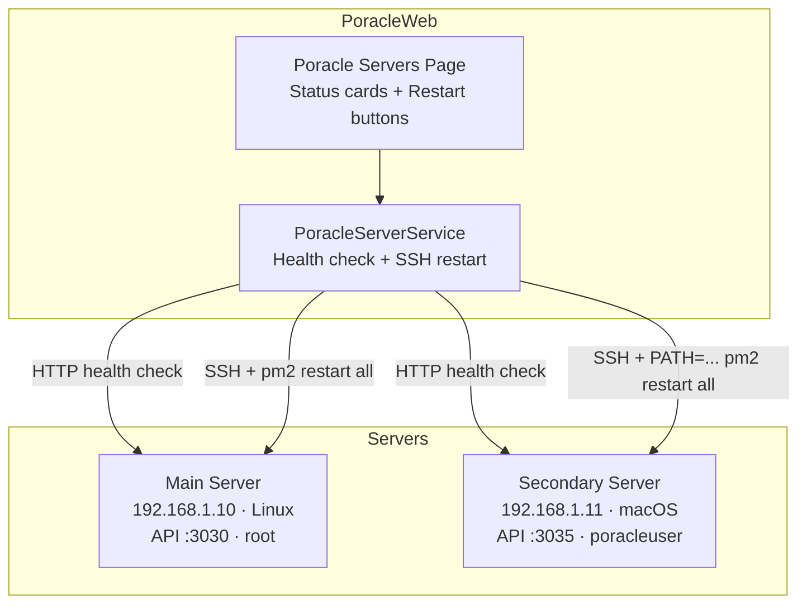
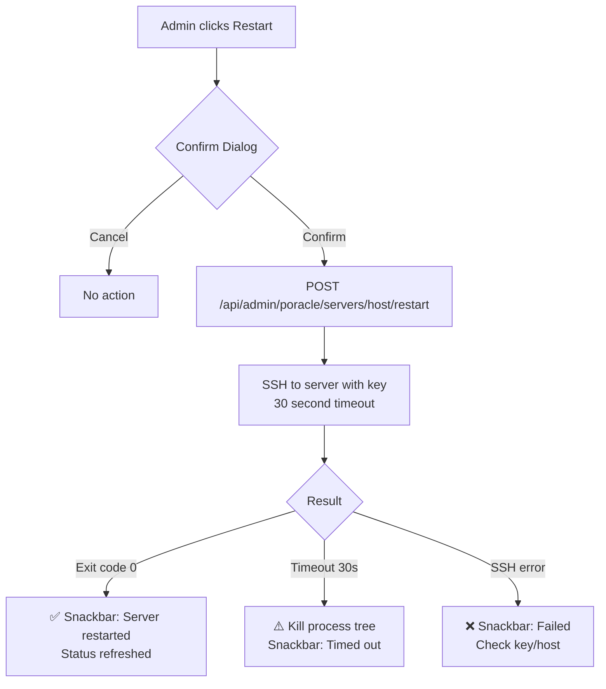

# PGAN.Poracle.Web

A web application for managing Poracle Pokemon GO notification alarms. Users authenticate via Discord OAuth2 or Telegram and configure personalized alert filters (Pokemon, Raids, Quests, Invasions, Lures, Nests, Gyms) through a browser-based UI.

## Tech Stack

- **Backend**: .NET 10 / ASP.NET Core Web API, EF Core with MySQL (Oracle provider)
- **Frontend**: Angular 21, Angular Material 21 (Material Design 3), Leaflet maps
- **Auth**: Discord OAuth2, Telegram Bot Login, JWT bearer tokens
- **Testing**: Jest (frontend), xUnit (backend)
- **CI/CD**: GitHub Actions, Docker (ghcr.io)

## Prerequisites

| Requirement | Version | Purpose |
|---|---|---|
| MySQL | 5.7+ or 8.0+ | Poracle database (existing Poracle installation) |
| Poracle | PoracleJS | Running instance with REST API enabled |
| Discord App | - | OAuth2 application for user authentication |
| Koji | - | Geofence management server (required for custom geofences feature) |
| .NET SDK | 10.0 | Backend development (not needed for Docker) |
| Node.js | 22+ | Frontend development (not needed for Docker) |
| Docker | 20+ | Production deployment |

## Quick Start (Docker)

This is the recommended way to run in production.

### 1. Create environment file

Copy the example and fill in your values:

```bash
cp .env.example .env
```

Edit `.env` with your configuration:

```env
# Database — your existing Poracle MySQL instance
DB_HOST=host.docker.internal    # Use host IP if not on same machine
DB_PORT=3306
DB_NAME=poracle
DB_USER=root
DB_PASSWORD=your_db_password

# JWT Secret — generate a random string, minimum 32 characters
JWT_SECRET=generate-a-long-random-secret-key-at-least-32-chars

# Discord OAuth2 — create an app at https://discord.com/developers/applications
# Set the redirect URI to: http://your-domain:8082/auth/discord/callback
DISCORD_CLIENT_ID=your_discord_client_id
DISCORD_CLIENT_SECRET=your_discord_client_secret
DISCORD_BOT_TOKEN=your_discord_bot_token      # Optional: enables avatar display
DISCORD_GUILD_ID=your_discord_server_id        # Optional: for guild-specific features

# Poracle API — your running PoracleJS instance
PORACLE_API_ADDRESS=http://host.docker.internal:3030
PORACLE_API_SECRET=your_poracle_api_secret
PORACLE_ADMIN_IDS=your_discord_user_id         # Comma-separated admin Discord IDs

# Poracle config directory — mount for DTS template previews
PORACLE_CONFIG_DIR=/path/to/PoracleJS/config

# Optional: PoracleWeb DB for custom geofences (separate from Poracle DB)
WEB_DB_HOST=host.docker.internal
WEB_DB_PORT=3306
WEB_DB_NAME=poracle_web
WEB_DB_USER=root
WEB_DB_PASSWORD=your_db_password

# Optional: Koji geofence API (required for custom geofences)
KOJI_API_ADDRESS=http://host.docker.internal:8080
KOJI_BEARER_TOKEN=your_koji_bearer_token
KOJI_PROJECT_ID=1
KOJI_PROJECT_NAME=your_koji_project_name   # Project name for /geofence/poracle/{name} endpoint

# Optional: Discord forum channel for geofence submission threads
DISCORD_GEOFENCE_FORUM_CHANNEL_ID=

# Optional: Scanner DB for nest/Pokemon data
# SCANNER_DB_CONNECTION=Server=host.docker.internal;Port=3306;Database=rdmdb;User=root;Password=your_password

# Optional: Telegram authentication
TELEGRAM_ENABLED=false
TELEGRAM_BOT_TOKEN=
TELEGRAM_BOT_USERNAME=
```

### 2. Start with pre-built image from GitHub Container Registry

Pull the latest image from `ghcr.io` and start:

```bash
docker pull ghcr.io/pgan-dev/poracleweb.net:latest
```

Update `docker-compose.yml` to use the registry image:

```yaml
services:
  poracle-web:
    image: ghcr.io/pgan-dev/poracleweb.net:latest
    # ...rest of config
```

Then start:

```bash
docker compose up -d
```

The app will be available at **http://localhost:8082**.

### 3. Build from source (alternative)

If you want to build the Docker image locally instead of pulling from the registry:

```bash
# Build and tag the image
docker build -t poracleweb-local:latest .

# Update docker-compose.yml to use local image:
#   image: poracleweb-local:latest

# Start the container
docker compose up -d
```

To force a clean rebuild:

```bash
docker build --no-cache -t poracleweb-local:latest .
docker compose up -d --force-recreate
```

### Updating

```bash
# If using ghcr.io image:
docker pull ghcr.io/pgan-dev/poracleweb.net:latest
docker compose up -d --force-recreate

# If building from source:
git pull
docker build -t poracleweb-local:latest .
docker compose up -d --force-recreate
```

## Development Setup

### 1. Clone and install dependencies

```bash
git clone https://github.com/PGAN-Dev/PoracleWeb.NET.git
cd PoracleWeb.NET

# Install frontend dependencies
cd Applications/PGAN.Poracle.Web.App/ClientApp
npm install
cd ../../..
```

### 2. Configure secrets

Create `Applications/PGAN.Poracle.Web.Api/appsettings.Development.json` (gitignored):

```json
{
  "ConnectionStrings": {
    "PoracleDb": "Server=localhost;Port=3306;Database=poracle;User=root;Password=your_password;AllowZeroDateTime=true;ConvertZeroDateTime=true",
    "PoracleWebDb": "Server=localhost;Port=3306;Database=poracle_web;User=root;Password=your_password;AllowZeroDateTime=true;ConvertZeroDateTime=true",
    "ScannerDb": ""
  },
  "Jwt": {
    "Secret": "your-development-secret-key-at-least-32-characters-long"
  },
  "Discord": {
    "ClientId": "your_discord_client_id",
    "ClientSecret": "your_discord_client_secret",
    "RedirectUri": "http://localhost:4200/auth/discord/callback",
    "FrontendUrl": "http://localhost:4200",
    "BotToken": "your_discord_bot_token",
    "GuildId": "your_discord_guild_id",
    "GeofenceForumChannelId": ""
  },
  "Telegram": {
    "Enabled": false,
    "BotToken": "",
    "BotUsername": ""
  },
  "Poracle": {
    "ApiAddress": "http://localhost:3030",
    "ApiSecret": "your_poracle_secret",
    "AdminIds": "your_discord_user_id"
  },
  "Koji": {
    "ApiAddress": "http://localhost:8080",
    "BearerToken": "your_koji_bearer_token",
    "ProjectId": 1,
    "ProjectName": "your_koji_project_name"
  }
}
```

### 3. Run the application

You need two terminals — one for the backend API and one for the Angular dev server:

**Terminal 1 — Backend API (http://localhost:5048):**

```bash
cd Applications/PGAN.Poracle.Web.Api
dotnet run
```

**Terminal 2 — Frontend dev server (http://localhost:4200):**

```bash
cd Applications/PGAN.Poracle.Web.App/ClientApp
npm start
```

The Angular dev server proxies API requests to the .NET backend. Open **http://localhost:4200** in your browser.

### 4. Running tests

```bash
# Frontend tests (Jest)
cd Applications/PGAN.Poracle.Web.App/ClientApp
npm test

# Backend tests (xUnit)
dotnet test
```

### 5. Linting and formatting

```bash
cd Applications/PGAN.Poracle.Web.App/ClientApp

# Check lint
npm run lint

# Check formatting
npm run prettier-check

# Auto-fix lint issues
npx eslint --fix src/

# Auto-format code
npm run prettier-format
```

## Project Structure

```
PGAN.Poracle.Web.slnx
├── Applications/
│   ├── Web.Api/                    ASP.NET Core host
│   │   ├── Controllers/            REST API controllers (all under /api/)
│   │   │                           incl. UserGeofenceController, AdminGeofenceController,
│   │   │                           GeofenceFeedController
│   │   ├── Configuration/          DI registration, settings classes (incl. KojiSettings)
│   │   └── Services/               Background services (avatar cache, DTS cache)
│   └── Web.App/ClientApp/          Angular 21 SPA
│       └── src/app/
│           ├── core/               Guards, services, interceptors, models
│           ├── modules/            Feature pages (dashboard, pokemon, raids, geofences, etc.)
│           └── shared/             Reusable components (area-map, pokemon-selector,
│                                   region-selector, geofence-name-dialog,
│                                   geofence-approval-dialog, etc.)
│                                   utils/ (geo.utils: point-in-polygon, centroid)
├── Core/
│   ├── Core.Abstractions/          Interfaces (IRepository, IService, IUnitOfWork)
│   ├── Core.Models/                DTOs passed between layers
│   ├── Core.Mappings/              AutoMapper profiles
│   ├── Core.Repositories/          Data access implementations
│   ├── Core.Services/              Business logic (incl. UserGeofenceService, KojiService,
│   │                               DiscordNotificationService)
│   └── Core.UnitsOfWork/           Unit of work pattern
├── Data/
│   ├── Data/                       EF Core DbContexts (PoracleContext, PoracleWebContext),
│   │                               Entities (incl. UserGeofenceEntity), Configurations
│   └── Data.Scanner/               Optional scanner DB context (RDM)
└── Tests/
    └── PGAN.Poracle.Web.Tests/     xUnit backend tests
```

## Configuration Reference

All configuration can be provided via environment variables (Docker) or `appsettings.json` (development):

| Setting | Env Variable | Required | Description |
|---|---|---|---|
| `ConnectionStrings:PoracleDb` | `ConnectionStrings__PoracleDb` | Yes | MySQL connection to Poracle database |
| `ConnectionStrings:PoracleWebDb` | `ConnectionStrings__PoracleWebDb` | No | MySQL connection to PoracleWeb database (user geofences). Required for custom geofences feature. |
| `ConnectionStrings:ScannerDb` | `ConnectionStrings__ScannerDb` | No | Scanner database connection (RDM) |
| `Jwt:Secret` | `Jwt__Secret` | Yes | JWT signing key (minimum 32 characters) |
| `Jwt:ExpirationMinutes` | `Jwt__ExpirationMinutes` | No | Token expiry, default 1440 (24 hours) |
| `Discord:ClientId` | `Discord__ClientId` | Yes | Discord OAuth2 application client ID |
| `Discord:ClientSecret` | `Discord__ClientSecret` | Yes | Discord OAuth2 application client secret |
| `Discord:BotToken` | `Discord__BotToken` | No | Enables Discord avatar display |
| `Discord:GuildId` | `Discord__GuildId` | No | Discord server ID |
| `Discord:GeofenceForumChannelId` | `Discord__GeofenceForumChannelId` | No | Discord forum channel for geofence submission threads |
| `Telegram:Enabled` | `Telegram__Enabled` | No | Enable Telegram authentication (default: false) |
| `Telegram:BotToken` | `Telegram__BotToken` | No | Telegram bot token |
| `Telegram:BotUsername` | `Telegram__BotUsername` | No | Telegram bot username |
| `Poracle:ApiAddress` | `Poracle__ApiAddress` | Yes | Poracle API base URL |
| `Poracle:ApiSecret` | `Poracle__ApiSecret` | Yes | Poracle API shared secret |
| `Poracle:AdminIds` | `Poracle__AdminIds` | Yes | Comma-separated Discord admin user IDs |
| `Koji:ApiAddress` | `Koji__ApiAddress` | No | Koji geofence server URL. Required for custom geofences feature. |
| `Koji:BearerToken` | `Koji__BearerToken` | No | Koji API bearer token for authentication |
| `Koji:ProjectId` | `Koji__ProjectId` | No | Koji project ID for admin-promoted geofences (default: 0) |
| `Koji:ProjectName` | `Koji__ProjectName` | No | Koji project name for fetching geofences from `/geofence/poracle/{name}` endpoint. Required for unified geofence feed. |
| `Poracle:Servers` | `Poracle__Servers__0__Name`, etc. | No | Array of PoracleJS server configs (name, host, API address, SSH user) for remote management |
| `Poracle:SshKeyPath` | `Poracle__SshKeyPath` | No | Path to SSH private key inside container (default `/app/ssh_key`) |
| `Cors:AllowedOrigins` | `Cors__AllowedOrigins__0` | No | Allowed CORS origin (empty = allow all) |

## Custom Geofences Setup

Users can draw custom polygon geofences on the "My Geofences" page for precise notification zones (e.g., park boundaries) instead of distance-from-center circles.

### How it works

PoracleWeb acts as the **single geofence source** for PoracleJS. Instead of PoracleJS connecting to Koji directly, PoracleWeb fetches admin geofences from Koji, resolves group names from the Koji parent chain, merges them with user-drawn geofences from its own database, and serves everything via one endpoint. No custom code is needed in PoracleJS or Koji — standard upstream versions work.

1. User draws a polygon on the map, saved to the PoracleWeb database
2. PoracleWeb serves a **unified geofence feed** via `GET /api/geofence-feed` — admin geofences from Koji (cached 5 minutes) plus user geofences from the local DB
3. PoracleJS loads **all** geofences from a single PoracleWeb URL (no direct Koji connection needed)
4. User geofences have `displayInMatches: false` — names are hidden from all DMs for privacy
5. Admin geofences have `displayInMatches: true` and `group` populated from Koji parent hierarchy
6. Users can submit geofences for admin review, which creates a Discord forum post with a static map
7. Admins approve, and the geofence is promoted to Koji as a public area visible to all users
8. If Koji is unreachable, user geofences are still served (graceful degradation)
9. If PoracleWeb itself is down, PoracleJS falls back to its built-in `.cache/` directory

### Component Diagram



**Detailed internal flow:**



### Geofence Lifecycle Flow



### Setup

1. **Create the PoracleWeb database** — a separate MySQL/MariaDB database for app-owned data:
   ```sql
   CREATE DATABASE poracle_web;
   ```
   The `user_geofences` table is created automatically on first run.

2. **Configure the Koji connection** — set the following in your environment or `appsettings.json`:
   - `Koji:ApiAddress` — Koji server URL (e.g., `http://localhost:8080`)
   - `Koji:BearerToken` — Koji API bearer token
   - `Koji:ProjectId` — Koji project ID for promoted geofences
   - `Koji:ProjectName` — Koji project name, used to fetch geofences from the `/geofence/poracle/{name}` endpoint

3. **Point PoracleJS to PoracleWeb** — set `geofence.path` to a single PoracleWeb URL. PoracleJS no longer needs a direct Koji connection for geofences:
   ```json
   "geofence": {
     "path": "http://poracleweb-host:8082/api/geofence-feed"
   }
   ```
   Remove `kojiOptions.bearerToken` from the PoracleJS geofence config if present (it is harmless if left, but no longer needed).

4. **Remove `group_map.json`** from PoracleJS if it exists — group names are now resolved automatically from the Koji parent chain by PoracleWeb.

5. **Restart PoracleJS** — `pm2 restart all`

6. **Discord forum channel** (optional) — for geofence submission discussions. Set `Discord:GeofenceForumChannelId` and give the bot **View Channel**, **Send Messages in Threads**, and **Manage Threads** permissions on the channel. Forum tags (Pending/Approved/Rejected) are auto-created if the bot has **Manage Channels** permission, or create them manually.

> **PoracleJS Failover**: PoracleJS's built-in `.cache/` directory automatically caches geofence data. If PoracleWeb is temporarily unavailable, PoracleJS falls back to its last cached copy.

## Poracle Server Management Setup

Admins can monitor and restart PoracleJS instances remotely from the "Poracle Servers" admin page.

### How it works

1. Health check pings each server's API endpoint — any HTTP response = online, no response = offline
2. Restart executes an SSH command (default: `pm2 restart all`) on the remote server
3. Each server can have a custom restart command (e.g., for macOS where PM2 isn't in PATH)

### Component Diagram



### Restart Flow



### Requirements

1. **SSH key** — mount a private key that has access to your PoracleJS servers:
   ```yaml
   # docker-compose.yml
   volumes:
     - /path/to/your/ssh_key:/app/ssh_key:ro
   ```
   Or in `docker-compose.override.yml`:
   ```yaml
   services:
     poracle-web:
       volumes:
         - ~/.ssh/id_ed25519:/app/ssh_key:ro
   ```

2. **Server configuration** — add servers via environment variables in `.env`:
   ```env
   # Server 1 (Linux)
   PORACLE_SERVER_1_NAME=Main
   PORACLE_SERVER_1_HOST=192.168.1.10
   PORACLE_SERVER_1_API=http://192.168.1.10:3030
   PORACLE_SERVER_1_SSH_USER=root
   # PORACLE_SERVER_1_RESTART_CMD=pm2 restart all   # default

   # Server 2 (macOS — needs full PATH for PM2)
   PORACLE_SERVER_2_NAME=Secondary
   PORACLE_SERVER_2_HOST=192.168.1.11
   PORACLE_SERVER_2_API=http://192.168.1.11:3035
   PORACLE_SERVER_2_SSH_USER=poracleuser
   PORACLE_SERVER_2_RESTART_CMD=PATH=/opt/homebrew/bin:/usr/local/bin:/usr/bin:/bin pm2 restart all
   ```

3. **SSH access** — ensure the SSH key is authorized on each PoracleJS server (`~/.ssh/authorized_keys`).

4. **Firewall** — the Docker container needs SSH access (port 22) to each PoracleJS server, and HTTP access to each server's API port for health checks.

## Docker Compose Details

The `docker-compose.yml` configures:

- **Port mapping**: Host `8082` → Container `8080`
- **Volumes**: `./data` for avatar/DTS cache persistence, Poracle config directory (read-only)
- **Health check**: HTTP check every 30s with 15s startup grace period
- **Resource limits**: 2 CPUs, 2GB memory
- **Logging**: JSON file driver, 10MB max per file, 3 file rotation
- **Restart policy**: `unless-stopped`

## Discord OAuth2 Setup

1. Go to [Discord Developer Portal](https://discord.com/developers/applications)
2. Create a new application
3. Under **OAuth2**, add a redirect URI:
   - Production: `http://your-domain:8082/auth/discord/callback`
   - Development: `http://localhost:4200/auth/discord/callback`
4. Copy the **Client ID** and **Client Secret**
5. Optionally, create a Bot under the application for avatar display support

## CI/CD

Two GitHub Actions workflows run on push to `main` and pull requests:

- **ci.yml**: Builds backend (.NET 10), runs backend tests, builds frontend (Angular), runs lint/prettier/jest
- **docker-publish.yml**: Builds Docker image and publishes to [`ghcr.io/pgan-dev/poracleweb.net`](https://github.com/PGAN-Dev/PoracleWeb.NET/pkgs/container/poracleweb.net) with `latest` and commit SHA tags

## Features

- **Alarm Management**: Create, edit, and delete filters for Pokemon, Raids, Quests, Invasions, Lures, Nests, and Gyms
- **Bulk Operations**: Multi-select alarms with bulk delete and bulk distance update
- **Quick Picks**: Admin-defined alarm templates users can apply with one click
- **Area Management**: Interactive Leaflet map for selecting geofence areas
- **Custom Geofences**: Users can draw custom geofence polygons on a map, which are automatically added to their active areas. Geofences are served to PoracleJS via a built-in feed endpoint. Users can submit geofences for admin review to be promoted to public areas.
- **Geofence Admin Review**: Admins can review, approve, or reject user-submitted geofences. Approved geofences are promoted to Koji as public areas. Discord forum integration provides threaded discussion for each submission with auto-tagging (Pending/Approved/Rejected).
- **Profile Switching**: Multiple alarm profiles per user
- **Discord Notification Preview**: Live preview of DTS templates with Handlebars evaluation
- **Dark/Light Mode**: Theme toggle with localStorage persistence
- **Accent Themes**: Customizable toolbar and UI accent colors (Pokemon, Raids, Mystic, Valor, Instinct)
- **Responsive Design**: Full mobile support with fullscreen dialogs and collapsible sidebar
- **Onboarding Wizard**: First-run setup guide for new users
- **Keyboard Shortcuts**: `?` for help, `[`/`]` for sidebar collapse
- **18 Languages**: Pokemon name localization
- **Poracle Server Management**: Monitor health and restart PoracleJS instances remotely from the admin panel, with multi-server support and SSH + PM2 integration
- **Admin Panel**: User management, webhook configuration, site settings, geofence submission review
