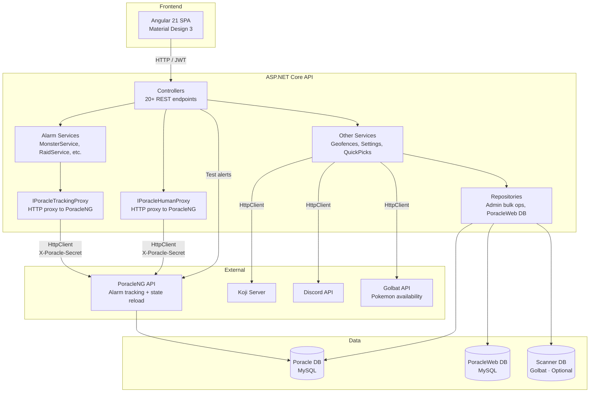

# Architecture Overview

PoracleWeb.NET is a full-stack application with a .NET 10 backend API and Angular 21 frontend SPA.

## Solution structure

```
Pgan.PoracleWebNet.slnx
├── Applications/
│   ├── Web.Api/                    ASP.NET Core host
│   │   ├── Controllers/            REST API controllers (all under /api/)
│   │   ├── Configuration/          DI registration, settings classes
│   │   └── Services/               Background services (avatar cache, DTS cache)
│   └── Web.App/ClientApp/          Angular 21 SPA
│       └── src/app/
│           ├── core/               Guards, services, interceptors, models
│           ├── modules/            Feature pages (dashboard, pokemon, raids, etc.)
│           └── shared/             Reusable components, utilities
├── Core/
│   ├── Core.Abstractions/          Interfaces (IService, IPoracleTrackingProxy, IPoracleHumanProxy)
│   ├── Core.Models/                DTOs passed between layers
│   ├── Core.Mappings/              AutoMapper profiles (Human, Profile, PoracleWeb.NET tables)
│   ├── Core.Repositories/          Data access (Human, Profile, PoracleWeb-owned tables)
│   └── Core.Services/              Business logic + PoracleNG API proxies
├── Data/
│   ├── Data/                       EF Core DbContexts, Entities, Configurations
│   └── Data.Scanner/               Optional scanner DB context (Golbat)
└── Tests/
    └── Pgan.PoracleWebNet.Tests/     xUnit backend tests
```

## Layer diagram



!!! info "All operations go through PoracleNG"
    All alarm tracking CRUD (including Fort Change and Max Battle types) is proxied via `IPoracleTrackingProxy`. Single-user human/profile operations (reads, creates, location, areas, profile switch) are proxied via `IPoracleHumanProxy`. Direct database access is only used for admin bulk operations (`GetAllAsync`, `DeleteUserAsync`, `UpdateAsync`) and application-owned data (`poracle_web` database). Optional integrations include Pokemon availability from Golbat API and weather data from Poracle API. See [PoracleNG API Proxy](poracleng-proxy.md) for details.

## Key design decisions

### Operations proxied through PoracleNG
All alarm tracking writes (create, update, delete) and single-user human/profile operations go through the PoracleNG REST API, not directly to the database. PoracleNG applies field defaults (`cleanRow()`), detects duplicates, handles area dual-writes, and triggers immediate state reload. This eliminates data integrity bugs caused by missing defaults or stale state. Profile duplication uses PoracleNG's copy endpoint to clone all tracking rules atomically. Supported alarm types include Pokemon, Raids, Eggs, Quests, Invasions, Lures, Nests, Gyms, Fort Changes, and Max Battles. Test alerts are sent via PoracleNG's `POST /api/test` endpoint, which formats and delivers a mock notification to the user. See [PoracleNG API Proxy](poracleng-proxy.md).

### Separate databases
PoracleWeb.NET does **not** modify the Poracle DB schema. The Poracle database is managed by PoracleNG. Application-owned data (user geofences, site settings, webhook delegates, quick pick definitions) lives in a separate `poracle_web` database managed by EF Core migrations.

### Unified geofence feed
PoracleWeb.NET acts as the single geofence source for PoracleJS. It fetches admin geofences from Koji, merges them with user-drawn geofences, and serves everything via one endpoint (`GET /api/geofence-feed`). No custom code needed in PoracleJS or Koji. User geofences support GeoJSON import/export for interoperability with external mapping tools.

### AutoMapper for partial updates
All update models use nullable `int?` properties so partial updates don't zero out unset fields. The mapping profile skips null properties automatically. Note: AutoMapper is now only used for non-alarm entities (humans, profiles). Alarm data flows as raw JSON through the PoracleNG API proxy.

### Gym picker
The `GymPickerComponent` (shared) lets users search for specific gyms when creating team, raid, or egg alarms. It calls the `ScannerService` (frontend) which hits scanner gym search endpoints on the backend (`ScannerController`). Search results use the `GymSearchResult` model and include photo thumbnails and area names resolved via the `PointInPolygon` geo utility. The scanner DB is optional — when not configured, the gym picker is hidden.

### Per-IP rate limiting
Auth endpoints use per-IP partitioned rate limiting (not global). This prevents one user's activity from locking out others.
