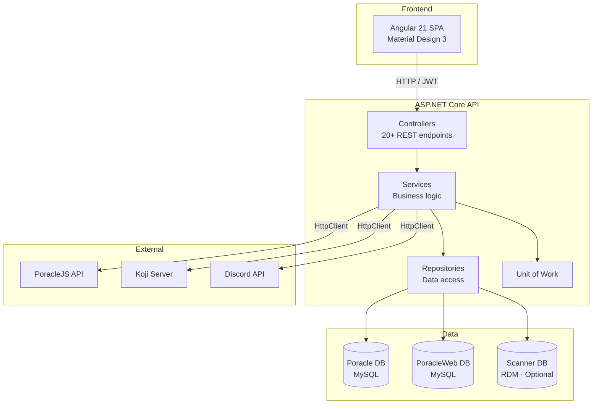

# Architecture Overview

PoracleWeb is a full-stack application with a .NET 10 backend API and Angular 21 frontend SPA.

## Solution structure

```
PGAN.Poracle.Web.slnx
├── Applications/
│   ├── Web.Api/                    ASP.NET Core host
│   │   ├── Controllers/            REST API controllers (all under /api/)
│   │   ├── Configuration/          DI registration, settings classes
│   │   └── Services/               Background services (avatar cache, DTS cache)
│   └── Web.App/ClientApp/          Angular 21 SPA
│       └── src/app/
│           ├── core/               Guards, services, interceptors, models
│           ├── modules/            Feature pages (dashboard, pokemon, raids, etc.)
│           └── shared/             Reusable components, utilities
├── Core/
│   ├── Core.Abstractions/          Interfaces (IRepository, IService, IUnitOfWork)
│   ├── Core.Models/                DTOs passed between layers
│   ├── Core.Mappings/              AutoMapper profiles
│   ├── Core.Repositories/          Data access implementations
│   ├── Core.Services/              Business logic
│   └── Core.UnitsOfWork/           Unit of work pattern
├── Data/
│   ├── Data/                       EF Core DbContexts, Entities, Configurations
│   └── Data.Scanner/               Optional scanner DB context (RDM)
└── Tests/
    └── PGAN.Poracle.Web.Tests/     xUnit backend tests
```

## Layer diagram



## Key design decisions

### Separate databases
PoracleWeb does **not** modify the Poracle DB schema. The Poracle database remains exclusively managed by PoracleJS. Application-owned data (user geofences, etc.) lives in a separate `poracle_web` database.

### Unified geofence feed
PoracleWeb acts as the single geofence source for PoracleJS. It fetches admin geofences from Koji, merges them with user-drawn geofences, and serves everything via one endpoint (`GET /api/geofence-feed`). No custom code needed in PoracleJS or Koji.

### AutoMapper for partial updates
All update models use nullable `int?` properties so partial updates don't zero out unset fields. The mapping profile skips null properties automatically.

### Per-IP rate limiting
Auth endpoints use per-IP partitioned rate limiting (not global). This prevents one user's activity from locking out others.
