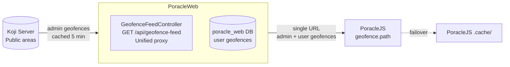
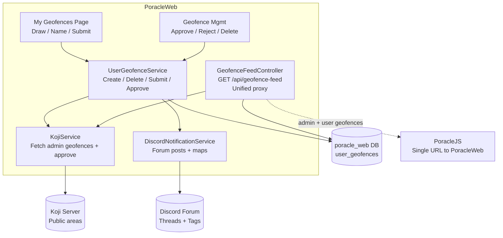
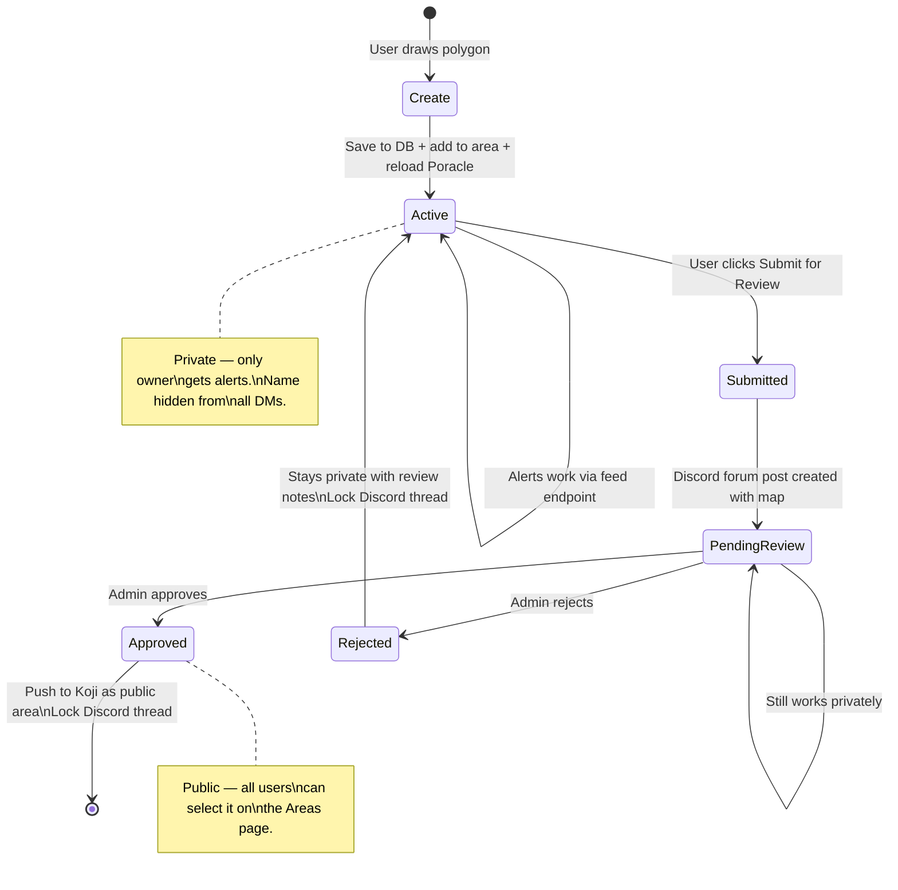

# Custom Geofences

Users can draw custom polygon geofences on the "My Geofences" page for precise notification zones (e.g., park boundaries) instead of distance-from-center circles.

## How it works

PoracleWeb.NET acts as the **single geofence source** for PoracleJS. Instead of PoracleJS connecting to Koji directly, PoracleWeb.NET fetches admin geofences from Koji, resolves group names from the Koji parent chain, merges them with user-drawn geofences from its own database, and serves everything via one endpoint. No custom code is needed in PoracleJS or Koji — standard upstream versions work.

1. User draws a polygon on the map, saved to the PoracleWeb.NET database
2. PoracleWeb.NET serves a **unified geofence feed** via `GET /api/geofence-feed` — admin geofences from Koji (cached 5 minutes) plus user geofences from the local DB
3. PoracleJS loads **all** geofences from a single PoracleWeb.NET URL (no direct Koji connection needed)
4. User geofences have `displayInMatches: false` — names are hidden from all DMs for privacy
5. Admin geofences have `displayInMatches: true` and `group` populated from Koji parent hierarchy
6. Users can submit geofences for admin review, which creates a Discord forum post with a static map
7. Admins approve, and the geofence is promoted to Koji as a public area visible to all users
8. If Koji is unreachable, user geofences are still served (graceful degradation)
9. If PoracleWeb.NET itself is down, PoracleJS falls back to its built-in `.cache/` directory

## Component diagram



## Detailed internal flow



## Geofence lifecycle



## Admin geofence management

Admins can view and manage all user-created geofences from the **User Geofences** page in the Admin sidebar (`/admin/geofence-submissions`).

### View modes

The page supports three view modes, toggled via the toolbar:

- **Card view** (default) — Map thumbnail cards grouped by region in collapsible expansion panels. Each card shows the geofence polygon, owner with avatar, status chip, metadata, and action buttons. Map thumbnails are lazy-loaded via `IntersectionObserver` and preserved across view switches.
- **List view** — Compact table grouped by region in collapsible expansion panels. Columns: Name, Status, Owner (with avatar), Region, Points, Created, Actions.
- **Table view** — Flat ungrouped table showing all geofences with sortable columns. Columns: Name, Status, Owner, Region, Points, Created, Submitted, Reviewed By, Actions. Click column headers to sort ascending/descending.

### Features

- **Region grouping** — Card and list views group geofences by their `groupName` (region). Each group has a collapsible `mat-expansion-panel` with the region name and a geofence count badge. Regions are sorted alphabetically, with "No Region" last.
- **Sortable columns** — Table view supports sorting by name, status, owner, region, points, created, and submitted date. Click a column header to sort; click again to reverse direction. Sorting also applies to the card and list views.
- **Owner display names and avatars** — Resolves Discord/Telegram usernames from the Poracle `humans` table instead of showing raw user IDs. Circular avatars (24px) are displayed next to owner names. Fallback: generic person icon when no avatar is available.
- **Reviewer display names and avatars** — The `reviewedBy` field is resolved to the reviewer's Discord username and avatar via the same batch human lookup. Reviewer avatars (16px) appear in card metadata and the table's Reviewed By column.
- **Map thumbnails** — Each geofence card shows a non-interactive Leaflet map preview with the polygon rendered in its status color. Thumbnails are lazy-loaded via `IntersectionObserver` for performance.
- **Detail dialog** — Click a card's map thumbnail or View button to open an interactive Leaflet map dialog with:
    - Full summary panel (name, owner, group, status, point count, area in km²/m², dates, review notes)
    - Interactive pan/zoom map with the polygon auto-fitted to bounds
    - Reference geofences from Poracle areas shown as dashed colored outlines (same palette as the Areas page) with name tooltips on hover
- **Point count and area** — Each geofence shows its vertex count and computed area (m² for areas under 1 km², km² otherwise) using the spherical excess formula
- **Status filtering** — Filter tabs for All, Pending, Active, Approved, and Rejected with counts. Filters apply across all view modes.
- **Skeleton loading** — Animated skeleton cards with map placeholders during data fetch

### Owner and reviewer resolution

Owner and reviewer names are resolved via a single batch lookup against the Poracle `humans` table. Distinct owner IDs and reviewer IDs are merged and fetched in one pass for efficiency. Avatars are served from `AvatarCacheService` with Discord CDN default fallback. The `UserGeofence` model exposes `ownerName`, `ownerAvatarUrl`, `reviewedByName`, and `reviewedByAvatarUrl` as enriched (non-mapped) properties set by `UserGeofenceService.GetAllWithDetailsAsync()` and `AdminGeofenceController.GetAll`.

## Geofence statuses

| Status | Description |
|---|---|
| `active` | Private, user-only. Alerts work via the feed endpoint. |
| `pending_review` | Submitted for admin review. Discord forum post created. Still works privately. |
| `approved` | Promoted to Koji as a public area. Visible to all users. |
| `rejected` | Remains private with review notes. User can continue using it. |

## Limits

- Maximum **10** custom geofences per user
- Polygons limited to **500** points

## Naming rules

- Geofence names (`kojiName` field) are always **lowercase** because Poracle does case-sensitive area matching
- Names are auto-generated from the user-provided display name (lowercased)
- Collisions are resolved by appending a numeric suffix

## GeoJSON Import & Export

Custom geofences can be exported and imported using the standard [GeoJSON](https://geojson.org/) format, making it easy to work with external GIS tools or migrate geofences between systems.

### Export

1. Click the **download/export** button on the My Geofences page
2. Select which geofences to include in the export
3. The file is exported as a standard GeoJSON `FeatureCollection`
4. Each geofence becomes a `Feature` with `Polygon` geometry
5. Feature properties include `name`, `region`, and `status`


The exported file is compatible with any GIS tool that supports GeoJSON, including [geojson.io](https://geojson.io), QGIS, Google Earth, and others.

### Import

1. Click the **upload/import** button on the My Geofences page
2. Paste GeoJSON text directly or upload a `.geojson` file
3. Each `Polygon` in the `FeatureCollection` creates a new geofence
4. Review and rename each geofence before saving
5. Region auto-detection applies to imported polygons (same as hand-drawn geofences)
6. Names are auto-generated from Feature `properties` (e.g., `name` or `title`) or fall back to the polygon index
7. Imported geofences count toward the **10-geofence-per-user limit**


!!! tip "Use cases"
    - **Migrating from other systems** — Export geofences from another Pokemon GO tool or mapping platform and import them into PoracleWeb.NET
    - **Drawing in desktop GIS tools** — Use QGIS or geojson.io for precise polygon editing, then import the result
    - **Sharing boundaries between users** — One user exports their geofences and another imports them

## Caching

- Admin geofences from Koji are cached in memory for **5 minutes** (`IMemoryCache`)
- Cache is invalidated when a geofence is approved/promoted to Koji
- User geofences are served directly from the database (no caching)

## Failover

| Failure | Behavior |
|---|---|
| Koji unreachable | Feed endpoint logs the error, still serves user geofences from DB |
| PoracleWeb.NET down | PoracleJS falls back to its built-in `.cache/` directory |

## Setup

### 1. Create the PoracleWeb.NET database

A separate MySQL/MariaDB database for app-owned data:

```sql
CREATE DATABASE poracle_web;
```

The `user_geofences` table is created automatically on first run.

### 2. Configure the Koji connection

Set the following in your environment or `appsettings.json`:

- `Koji:ApiAddress` — Koji server URL (e.g., `http://localhost:8080`)
- `Koji:BearerToken` — Koji API bearer token
- `Koji:ProjectId` — Koji project ID for promoted geofences
- `Koji:ProjectName` — Koji project name, used to fetch from `/geofence/poracle/{name}`

### 3. Point PoracleJS to PoracleWeb.NET

Set `geofence.path` in PoracleJS config to a single PoracleWeb.NET URL:

```json
"geofence": {
  "path": "http://poracleweb-host:8082/api/geofence-feed"
}
```

Remove `kojiOptions.bearerToken` from the PoracleJS geofence config if present (it is harmless if left, but no longer needed).

### 4. Remove group_map.json

Remove `group_map.json` from PoracleJS if it exists — group names are now resolved automatically from the Koji parent chain by PoracleWeb.

### 5. Restart PoracleJS

```bash
pm2 restart all
```

### 6. Discord forum channel (optional)

For geofence submission discussions:

1. Set `Discord:GeofenceForumChannelId` to your forum channel ID
2. Give the bot **View Channel**, **Send Messages in Threads**, and **Manage Threads** permissions
3. Forum tags (Pending/Approved/Rejected) are auto-created if the bot has **Manage Channels** permission, or create them manually

!!! tip "PoracleJS failover"
    PoracleJS's built-in `.cache/` directory automatically caches geofence data. If PoracleWeb.NET is temporarily unavailable, PoracleJS falls back to its last cached copy.
