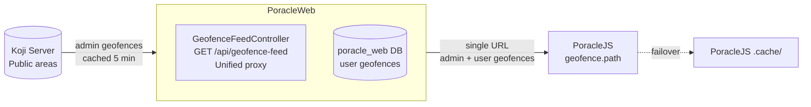
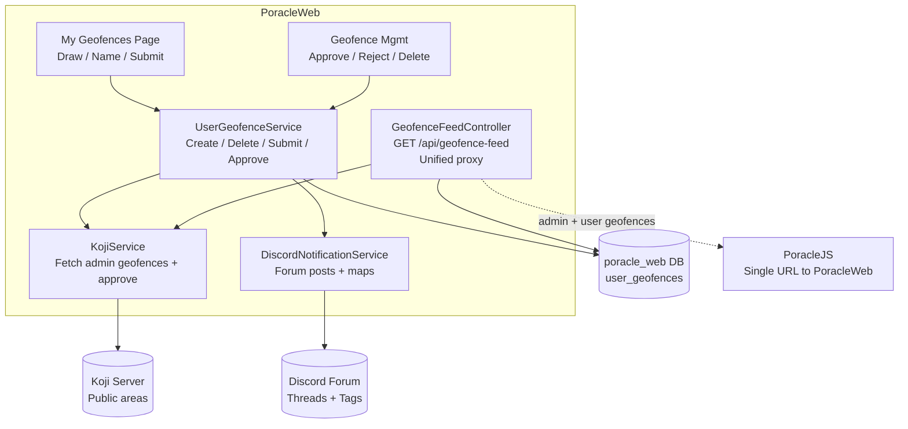
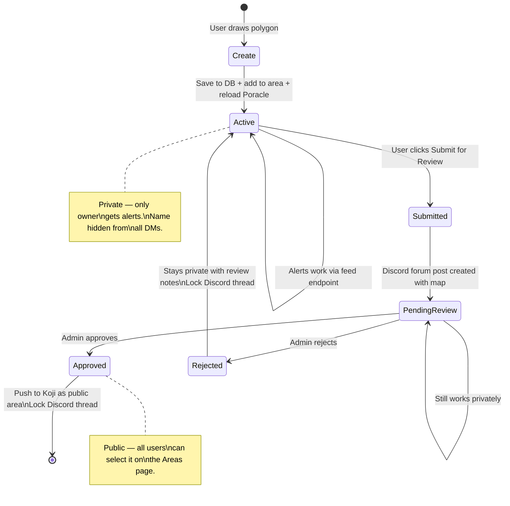

# Custom Geofences

Users can draw custom polygon geofences on the "My Geofences" page for precise notification zones (e.g., park boundaries) instead of distance-from-center circles.

## How it works

PoracleWeb acts as the **single geofence source** for PoracleJS. Instead of PoracleJS connecting to Koji directly, PoracleWeb fetches admin geofences from Koji, resolves group names from the Koji parent chain, merges them with user-drawn geofences from its own database, and serves everything via one endpoint. No custom code is needed in PoracleJS or Koji — standard upstream versions work.

1. User draws a polygon on the map, saved to the PoracleWeb database
2. PoracleWeb serves a **unified geofence feed** via `GET /api/geofence-feed` — admin geofences from Koji (cached 5 minutes) plus user geofences from the local DB
3. PoracleJS loads **all** geofences from a single PoracleWeb URL (no direct Koji connection needed)
4. User geofences have `displayInMatches: false` — names are hidden from all DMs for privacy
5. Admin geofences have `displayInMatches: true` and `group` populated from Koji parent hierarchy
6. Users can submit geofences for admin review, which creates a Discord forum post with a static map
7. Admins approve, and the geofence is promoted to Koji as a public area visible to all users
8. If Koji is unreachable, user geofences are still served (graceful degradation)
9. If PoracleWeb itself is down, PoracleJS falls back to its built-in `.cache/` directory

## Component diagram



## Detailed internal flow



## Geofence lifecycle



## Geofence statuses

| Status | Description |
|---|---|
| `active` | Private, user-only. Alerts work via the feed endpoint. |
| `pending_review` | Submitted for admin review. Discord forum post created. Still works privately. |
| `approved` | Promoted to Koji as a public area. Visible to all users. |
| `rejected` | Remains private with review notes. User can continue using it. |

## Limits

- Maximum **10** custom geofences per user
- Polygons limited to **500** points

## Naming rules

- Geofence names (`kojiName` field) are always **lowercase** because Poracle does case-sensitive area matching
- Names are auto-generated from the user-provided display name (lowercased)
- Collisions are resolved by appending a numeric suffix

## Caching

- Admin geofences from Koji are cached in memory for **5 minutes** (`IMemoryCache`)
- Cache is invalidated when a geofence is approved/promoted to Koji
- User geofences are served directly from the database (no caching)

## Failover

| Failure | Behavior |
|---|---|
| Koji unreachable | Feed endpoint logs the error, still serves user geofences from DB |
| PoracleWeb down | PoracleJS falls back to its built-in `.cache/` directory |

## Setup

### 1. Create the PoracleWeb database

A separate MySQL/MariaDB database for app-owned data:

```sql
CREATE DATABASE poracle_web;
```

The `user_geofences` table is created automatically on first run.

### 2. Configure the Koji connection

Set the following in your environment or `appsettings.json`:

- `Koji:ApiAddress` — Koji server URL (e.g., `http://localhost:8080`)
- `Koji:BearerToken` — Koji API bearer token
- `Koji:ProjectId` — Koji project ID for promoted geofences
- `Koji:ProjectName` — Koji project name, used to fetch from `/geofence/poracle/{name}`

### 3. Point PoracleJS to PoracleWeb

Set `geofence.path` in PoracleJS config to a single PoracleWeb URL:

```json
"geofence": {
  "path": "http://poracleweb-host:8082/api/geofence-feed"
}
```

Remove `kojiOptions.bearerToken` from the PoracleJS geofence config if present (it is harmless if left, but no longer needed).

### 4. Remove group_map.json

Remove `group_map.json` from PoracleJS if it exists — group names are now resolved automatically from the Koji parent chain by PoracleWeb.

### 5. Restart PoracleJS

```bash
pm2 restart all
```

### 6. Discord forum channel (optional)

For geofence submission discussions:

1. Set `Discord:GeofenceForumChannelId` to your forum channel ID
2. Give the bot **View Channel**, **Send Messages in Threads**, and **Manage Threads** permissions
3. Forum tags (Pending/Approved/Rejected) are auto-created if the bot has **Manage Channels** permission, or create them manually

!!! tip "PoracleJS failover"
    PoracleJS's built-in `.cache/` directory automatically caches geofence data. If PoracleWeb is temporarily unavailable, PoracleJS falls back to its last cached copy.
