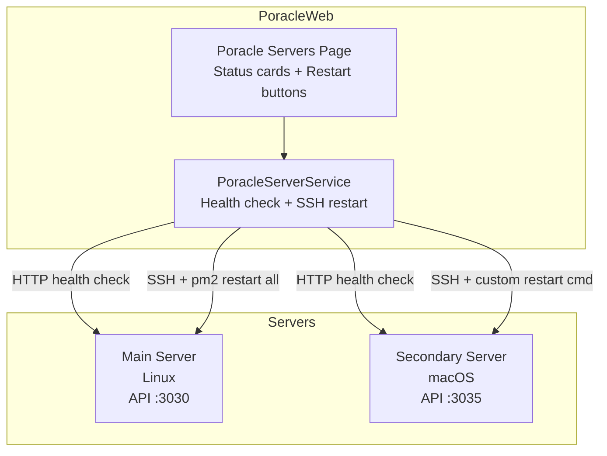
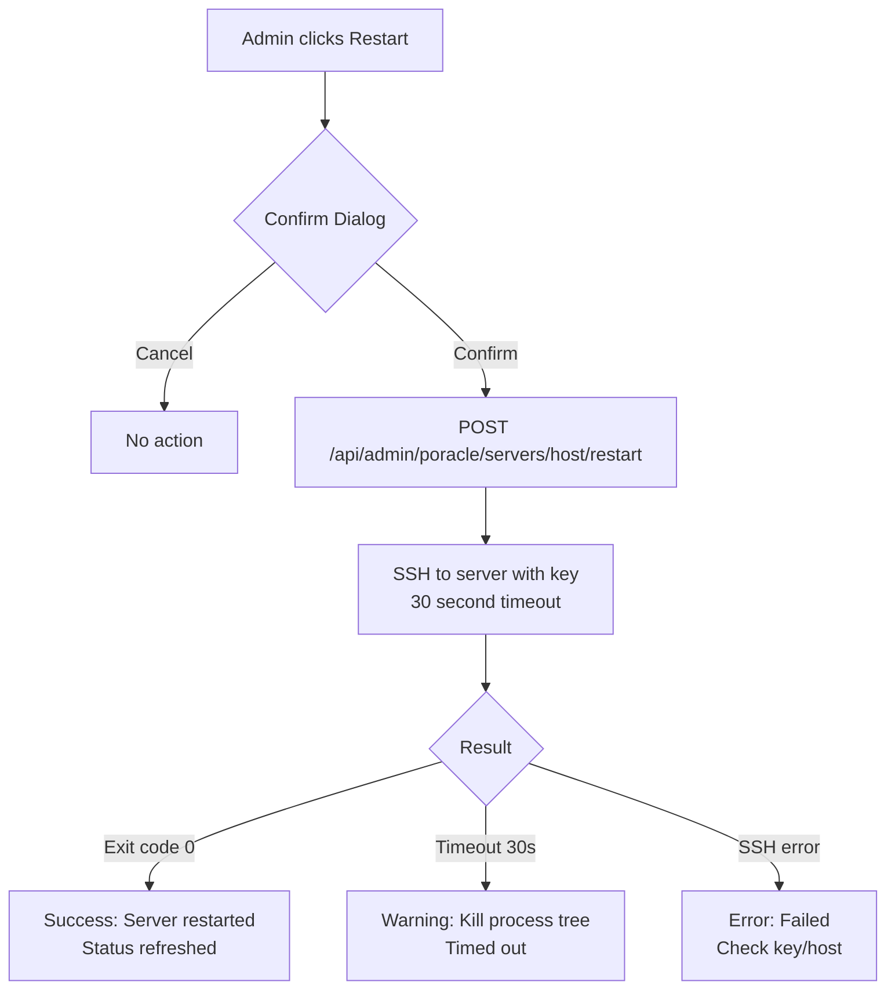

# Server Management

Admins can monitor and restart PoracleJS instances remotely from the "Poracle Servers" admin page.

## How it works

1. **Health check** — pings each server's API endpoint. Any HTTP response = online, no response = offline.
2. **Restart** — executes an SSH command (default: `pm2 restart all`) on the remote server.
3. Each server can have a **custom restart command** (e.g., for macOS where PM2 isn't in PATH).

## Component diagram



## Restart flow



## Setup

### 1. SSH key

Mount a private key that has access to your PoracleJS servers:

```yaml
# docker-compose.yml
volumes:
  - /path/to/your/ssh_key:/app/ssh_key:ro
```

Or in `docker-compose.override.yml`:

```yaml
services:
  poracle-web:
    volumes:
      - ~/.ssh/id_ed25519:/app/ssh_key:ro
```

### 2. Server configuration

Add servers via environment variables in `.env`:

```env
# Server 1 (Linux)
PORACLE_SERVER_1_NAME=Main
PORACLE_SERVER_1_HOST=192.168.1.10
PORACLE_SERVER_1_API=http://192.168.1.10:3030
PORACLE_SERVER_1_SSH_USER=root
# PORACLE_SERVER_1_RESTART_CMD=pm2 restart all   # default

# Server 2 (macOS — needs full PATH for PM2)
PORACLE_SERVER_2_NAME=Secondary
PORACLE_SERVER_2_HOST=192.168.1.11
PORACLE_SERVER_2_API=http://192.168.1.11:3035
PORACLE_SERVER_2_SSH_USER=poracleuser
PORACLE_SERVER_2_RESTART_CMD=PATH=/opt/homebrew/bin:/usr/local/bin:/usr/bin:/bin pm2 restart all
```

### 3. SSH access

Ensure the SSH key is authorized on each PoracleJS server (`~/.ssh/authorized_keys`).

### 4. Firewall

The Docker container needs:

- **SSH access** (port 22) to each PoracleJS server
- **HTTP access** to each server's API port for health checks
